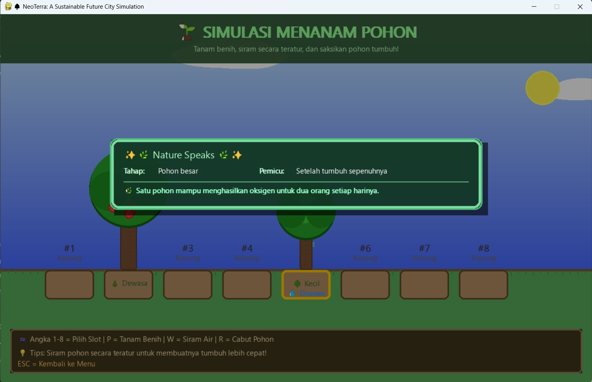

# 🌍 NeoTerra — Sustainable City Simulation  

**NeoTerra** adalah proyek simulasi interaktif berbasis **Python & Pygame** yang mengilustrasikan konsep kota berkelanjutan. Di dalamnya terdapat tiga mode simulasi utama yang dirancang untuk mengedukasi pengguna mengenai hubungan antara transportasi, lingkungan, dan ekosistem perkotaan.

---

## 🎮 Mode Simulasi

### 🏙️ 1. Smart City Simulator
Simulasi kota dengan mobil, bus, lampu lalu lintas, polusi, dan kepadatan lalu lintas yang dinamis.  
Fitur:
- Kendaraan muncul otomatis atau manual
- Sistem polusi udara & kemacetan real-time
- Animasi lampu lalu lintas
- Interaksi langsung untuk menambah atau menghapus kendaraan dan pohon

---

### 🌱 2. Tree Growing Simulator  
Sistem tumbuh-tumbuhan interaktif di mana pemain bisa menanam, merawat, dan menyaksikan pohon tumbuh melalui 4 tahap evolusi.  
Fitur:
- Efek animasi (sparkles, pelangi, kupu-kupu)
- Insight edukatif pada setiap tahap pertumbuhan
- Pertumbuhan buah ketika pohon matang

---

### 🌿 3. Green City Simulator  
Simulasi kehidupan kota hijau ramah lingkungan dengan sepeda, pejalan kaki, burung, awan, dan pembangkit listrik tenaga angin.

---

## 🕹️ Kontrol

| Tombol | Fungsi | Mode |
|--------|--------|------|
| `A` | Tambah mobil | Smart City |
| `Z` | Kurangi mobil | Smart City |
| `S` | Tambah bus | Smart City |
| `X` | Kurangi bus | Smart City |
| `D` | Tambah pohon | Smart City |
| `C` | Kurangi pohon | Smart City |
| `SPACE` | Auto-spawn kendaraan | Smart City |
| `ESC` | Kembali ke menu | Semua mode |
| `1–8` | Pilih slot tanaman | Plant Mode |
| `P` | Tanam benih | Plant Mode |
| `W` | Siram tanaman | Plant Mode |
| `R` | Cabut tanaman | Plant Mode |

---

## 📦 Instalasi

### 1️⃣ Clone Repository
```bash
git clone https://github.com/yourusername/NeoTerra.git
cd NeoTerra
```

### 1️⃣ Install 
Pastikan Python 3.9+ sudah terinstal.
```bash
pip install pygame
```
Atau jika tersedia:
```bash
pip install -r requirements.txt
```
Atau jika tersedia:
```bash
python NeoTerra.py
```

----

## 📘 Panduan Pengguna (User Guide)


## 🧭 Navigasi Utama

Ketika aplikasi dibuka, pengguna akan berada pada Main Menu.

Klik untuk memilih mode.

📸 **NeoTerra — Sustainable City Simulation**


Pilihan utama tersedia:

| Menu                       | Fungsi                            |
| -------------------------- | --------------------------------- |
| **Smart City Simulator**   | Simulasi lalu lintas dan polusi   |
| **Tree Growing Simulator** | Simulasi pertumbuhan pohon        |
| **Green City Simulator**   | Visualisasi kota ramah lingkungan |
| **Keluar**   | Keluar dari program |

---

## 🚗 Mode 1: Smart City Simulator
📸 **Ilustrasi:**


Tujuan:

Mengelola kota agar tetap seimbang antara aktivitas kendaraan dan kualitas udara.

Cara Menggunakan:

1. Tekan A untuk menambah mobil
2. Tekan Z untuk mengurangi mobil
3. Tekan S untuk menambah bus
4. Tekan X untuk mengurangi bus
5. Tekan D untuk menambah pohon sebagai penurun polusi
6. Tekan C untuk mengurangi pohon
7. Tekan SPACE untuk mode otomatis kendaraan
8. Tekan ESC untuk kembali ke menu utama

*Pantau indikator:*

- Traffic Density (Kepadatan)

- Air Quality Index (AQI)

Semakin banyak kendaraan → AQI naik

Semakin banyak pohon → AQI membaik


---
## 🌱 Mode 2: Tree Growing Simulator

📸 **Green City Simulator**

Tujuan:

Menanam, merawat, dan membesarkan pohon hingga dewasa.

Cara Menggunakan:

1. Pilih slot dengan tombol 1–8

2. Tekan P untuk menanam benih

3. Tekan W untuk menyiram

4. Amati perubahan fase pertumbuhan:

🌱 Seed → 🌿 Seedling → 🌳 Tree → 🍎 Fruit Tree

5. Insight edukatif akan muncul saat milestone pertumbuhan tercapai.


---
## 🌿 Mode 3: Green City Simulator

📸 **Green City Simulator**

Tujuan:

Melihat simulasi kota hijau ideal dengan transportasi ramah lingkungan dan energi rendah emisi.
Tidak ada kontrol manual — mode ini bersifat observasi (passive simulation).

---

## 🧠 Tujuan Project

Proyek ini bertujuan:
- Memberikan simulasi visual terkait pengaruh kendaraan dan penghijauan terhadap kualitas udara
- Mengedukasi nilai keberlanjutan lingkungan
- Melatih pemahaman mengenai sistem simulasi berbasis event dan animasi real-time

---
## 🛠️ Teknologi yang Digunakan

---

| Komponen   | Teknologi                   |
| ---------- | --------------------------- |
| Bahasa     | Python                      |
| Framework  | Pygame                      |
| Arsitektur | Object-Oriented Programming |
| Rendering  | 2D Real-Time Simulation     |

---
| Senia Nur Hasanah   | 140810230021     | 
| ---------- |---------- |

